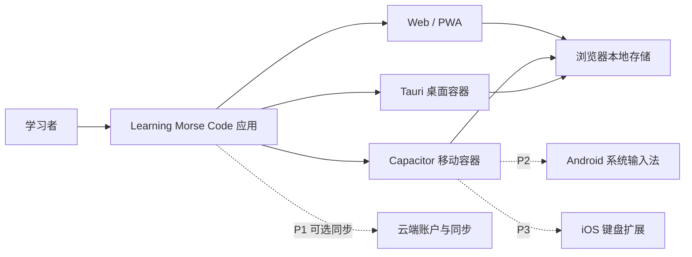
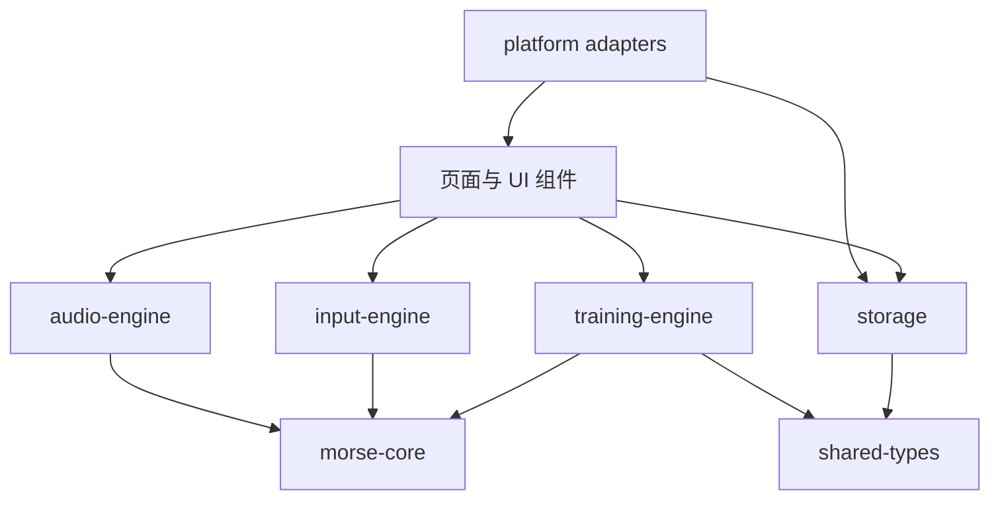
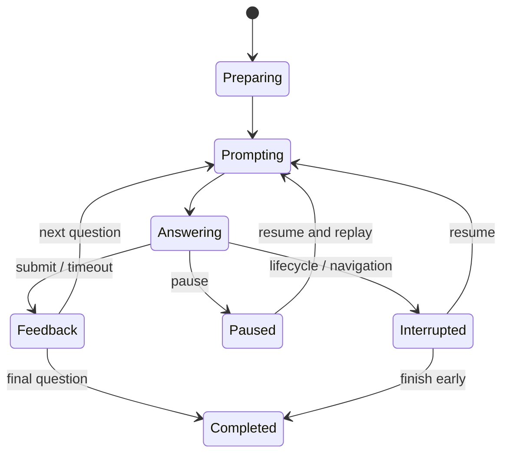

# Learning Morse Code 技术架构

> 本文档定义 MVP 的目标技术架构。当前私密发布的交互原型是研究产物，不等同于正式工程完成度。产品范围见 [FeatureList.md](./FeatureList.md)，产品行为见 [ProductSpec.md](./ProductSpec.md)，验证状态见 [ValidationReport.md](./ValidationReport.md)。

## 1. 文档信息

| 项目 | 内容 |
| --- | --- |
| 文档版本 | 0.1.0 |
| 状态 | MVP 架构基线 |
| 更新日期 | 2026-07-15 |
| 适用范围 | Web/PWA 核心及 Android、iOS、桌面封装边界 |
| 当前实现 | Vinext/React 交互原型，单页面内存状态 |
| 目标实现 | React + TypeScript + Vite 的本地优先客户端应用 |

## 2. 架构驱动因素

架构选择按以下优先顺序进行：

1. 音频节奏正确、按键反馈及时，且不受界面渲染明显干扰。
2. Morse 规则、题目生成、评分和统计可以脱离 UI 自动测试。
3. Web、移动端和桌面端复用同一套领域代码。
4. 无网络、无账户时仍能学习、练习并保存进度。
5. 训练会话可以安全中断和恢复，不丢失已提交答案。
6. 平台特有能力通过适配器接入，不污染领域层。
7. 系统级输入法作为独立原生交付物，不反向绑架 MVP 架构。

## 3. 当前原型与目标产品的边界

### 3.1 当前原型负责验证

- 页面信息层级和桌面/移动导航方向。
- 四种主题的设计令牌覆盖能力。
- Web Audio 的用户解锁、实时发声和定时播放。
- 单键长短按、双键点划、失焦停音和自动解码。
- 基础练习、反馈和结果页面的流程概念。

### 3.2 当前原型不能直接视为正式实现

- 页面切换仍是单文件内存状态，不是稳定路由。
- 训练题目和统计为研究数据，不具备完整业务模型。
- 尚无 IndexedDB 会话持久化、数据迁移和导入导出。
- 尚无 PWA Manifest、Service Worker 和离线更新策略。
- Effective WPM 目前只展示，尚未参与 Farnsworth 间隔计算。
- 主要逻辑仍集中在 `app/page.tsx`，需要按本文档拆分。

原型只作为交互和风险验证参考；正式代码迁移时保留已验证行为，不保留其单文件耦合方式。

## 4. 系统上下文



MVP 运行时不依赖云服务。Web、移动和桌面外壳只负责启动、生命周期及平台能力，训练规则由共享 TypeScript 包提供。

## 5. 目标工作区结构

正式实现采用 npm workspaces，保留当前 npm 工具链，避免仅为工作区更换包管理器。

```text
LearningMorseCode/
├─ apps/
│  ├─ web/                    # React + Vite + PWA 正式客户端
│  ├─ mobile/                 # Capacitor 配置、Android/iOS 工程
│  ├─ desktop/                # Tauri 配置和 Rust 外壳
│  ├─ android-ime/            # P2 Kotlin InputMethodService
│  └─ ios-keyboard/           # P3 Swift Keyboard Extension
├─ packages/
│  ├─ morse-core/             # 字符表、规范化、编解码、标准时间轴
│  ├─ audio-engine/           # Web Audio 调度、实时音调、生命周期
│  ├─ input-engine/           # 键盘、Pointer、触摸和外接设备适配
│  ├─ training-engine/        # 出题、会话状态机、评分、复习策略
│  ├─ storage/                # IndexedDB、迁移、导入导出、同步接口
│  ├─ platform/               # Web/Capacitor/Tauri 能力适配器
│  ├─ ui/                     # 设计令牌和复用组件
│  └─ shared-types/           # 跨包稳定数据协议
├─ tests/
│  ├─ fixtures/               # 固定字符集、时间轴和会话样本
│  ├─ integration/            # 引擎与存储组合测试
│  └─ e2e/                    # 核心用户路径
├─ FeatureList.md
├─ ProductSpec.md
├─ InformationArchitecture.md
├─ Architecture.md
└─ ValidationReport.md
```

### 5.1 原型迁移策略

1. 先将已验证的 `lib/morse-core.ts` 迁移到 `packages/morse-core`。
2. 将音频、按键和会话逻辑分别提取为无 UI 的服务。
3. 在 `apps/web` 重建稳定路由和页面壳，逐页迁移原型组件。
4. 新 Web 客户端达到功能等价后，停止维护根目录研究原型。
5. PWA 验证通过后再添加 Capacitor 和 Tauri 外壳。

## 6. 分层与依赖规则



必须遵守以下规则：

- `morse-core` 是纯 TypeScript，不访问 DOM、Web Audio、数据库或框架 API。
- `training-engine` 依赖 `morse-core` 和稳定数据类型，不依赖 React。
- `audio-engine` 接收已生成的时间轴，不负责决定题目或评分。
- `input-engine` 输出标准化输入事件，不直接修改 UI 或训练记录。
- `storage` 通过仓储接口保存领域对象，领域层不知道 IndexedDB/Dexie。
- `ui` 可以组合引擎，但引擎不得反向导入页面组件。
- Capacitor、Tauri、Kotlin 和 Swift 代码只能通过平台接口与共享核心通信。

循环依赖在持续集成中视为架构错误。

## 7. 核心领域模型

### 7.1 Morse 与时间模型

```ts
type MorseSymbol = "." | "-";

type TimingProfile = {
  characterWpm: number;
  effectiveWpm: number;
  frequencyHz: number;
  waveform: "sine" | "square";
  volume: number;
};

type ToneEvent = {
  character: string;
  symbol: MorseSymbol;
  startMs: number;
  durationMs: number;
};
```

- 点单位使用 `1200 / Character WPM` 毫秒。
- 划为 3 单位，元素间隔 1 单位，字符间隔 3 单位，单词间隔 7 单位。
- Farnsworth 只扩展字符和单词间隔，不改变字符内部点划。
- 时间轴生成必须是确定性纯函数，相同输入和配置始终得到相同事件列表。

### 7.2 练习定义

```ts
type PracticeMode =
  | "character-to-code"
  | "code-to-character"
  | "sound-to-character"
  | "character-to-keying";

type PracticeDefinition = {
  schemaVersion: number;
  mode: PracticeMode;
  characters: string[];
  questionCount: number;
  seed: string;
  timing: TimingProfile;
  timeoutMs: number | null;
  feedbackMode: "immediate" | "session-end";
};
```

开始会话时保存完整定义快照。用户后续修改默认设置，不得改变正在进行或历史会话的解释方式。

### 7.3 会话与作答

```ts
type SessionStatus =
  | "preparing"
  | "prompting"
  | "answering"
  | "feedback"
  | "paused"
  | "interrupted"
  | "completed";

type Attempt = {
  id: string;
  sessionId: string;
  questionIndex: number;
  target: string;
  response: string;
  correct: boolean;
  reactionMs: number;
  replayCount: number;
  timingScore: number | null;
  submittedAt: string;
};
```

同一道题的首次提交是统计主结果；纠正后的答案可以另行记录，但不能覆盖首次结果。

## 8. 训练引擎

训练引擎使用纯 reducer/state machine 表达状态，不在 MVP 引入额外状态机框架。



### 8.1 引擎职责

- 根据固定 seed 生成可重现题目。
- 防止连续超过 3 个完全相同目标。
- 管理题目、答案、暂停和恢复状态。
- 计算正确性、反应时间和节奏评分。
- 生成会话摘要和错题重练定义。
- 更新字符能力的增量数据。

### 8.2 不属于训练引擎的职责

- 播放声音。
- 监听浏览器按键。
- 写入具体数据库。
- 显示文案或动画。
- 调用平台振动和文件 API。

## 9. 音频架构

### 9.1 两条音频路径

**计划播放路径**用于字符、单词和句子：

1. `morse-core` 生成相对毫秒时间轴。
2. `audio-engine` 在一次播放开始时读取一个 `AudioContext.currentTime` 基准。
3. 所有音符使用 `baseTime + event.startMs` 调度。
4. 使用短增益包络避免爆音。
5. 使用播放令牌取消旧播放，避免字符切换后声音重叠。

禁止为每个音符分别读取当前时间作为基准；本轮原型已经修复该漂移风险。

**实时发报路径**用于按下即响：

1. `keydown`/`pointerdown` 进入输入引擎。
2. 确保 AudioContext 处于 running。
3. 创建或打开持续 oscillator/gain。
4. `keyup`/`pointerup` 关闭增益并停止 oscillator。
5. `blur`、`visibilitychange`、`pointercancel` 必须执行同一释放逻辑。

### 9.2 音频服务状态

```ts
type AudioEngineState = "locked" | "running" | "suspended" | "recovering" | "failed";
```

- 首次声音只能由用户手势解锁。
- 从后台恢复时检测上下文状态并尝试 `resume()`。
- 恢复失败时提供重试和静音继续，不阻塞非声音页面。
- 一个应用实例只维护一个 AudioContext，由音频服务统一管理。

### 9.3 长内容与 AudioWorklet

- MVP 的字符和短句可一次性调度完整时间轴。
- 连续抄收使用滚动调度窗口，避免一次创建过多 AudioNode。
- AudioWorklet 不作为 P0 前置依赖；只有噪声合成、复杂信道模拟或主线程测量证明有必要时才引入。

## 10. 输入架构

### 10.1 统一输入事件

```ts
type InputSource = "keyboard" | "pointer" | "touch" | "gamepad" | "external-key";

type KeySignal = {
  source: InputSource;
  control: "single" | "dot" | "dash";
  phase: "down" | "up" | "cancel";
  timestampMs: number;
};
```

所有平台输入先转换为 `KeySignal`，之后才进入点划判定和会话逻辑。

### 10.2 单键判定

- 使用 `performance.now()` 计算按压时长。
- 初始阈值为 2 个点单位。
- 阈值限制在 1 到 3 个单位之间，并提供校准。
- 双键模式由控制来源直接决定点或划，不使用时长分类。
- 自动重复键盘事件不得创建第二个按下状态。

### 10.3 输入安全

- 文本输入框获得焦点时不触发训练快捷键。
- 页面失焦、应用后台、组件卸载和 Pointer 取消必须释放按键。
- 浏览器/系统保留快捷键只显示警告，不承诺覆盖。
- 自由输入正文不进入训练分析或诊断日志。

## 11. 本地数据架构

### 11.1 存储选择

MVP 使用 IndexedDB，并通过 Dexie 实现事务、索引和版本迁移。Dexie 必须封装在 `packages/storage` 内；业务代码只使用仓储接口，未来可替换为 Capacitor/Tauri 原生存储而不修改训练引擎。

### 11.2 数据表

| 表 | 主键/关键索引 | 内容 |
| --- | --- | --- |
| `app_meta` | `key` | 数据库版本、首次启动、上次成功迁移 |
| `settings` | `scope` | 外观、音频、输入和训练默认值 |
| `sessions` | `id`, `status`, `startedAt` | 会话定义快照、进度和摘要 |
| `attempts` | `id`, `[sessionId+questionIndex]` | 逐题首次作答和必要诊断数据 |
| `character_stats` | `[character+mode]` | 次数、正确率、反应时间、最近练习 |
| `flags` | `character` | 收藏和“需要加强”标记 |
| `course_progress` | `courseId` | P1 课程步骤和解锁状态 |

MVP 只有一个本地默认 profile；不提前设计多账户关系表。

### 11.3 写入策略

- 开始会话时事务写入会话和题目快照。
- 每次提交答案后立即写入 attempt 和会话进度。
- 会话完成时事务写入摘要并更新字符聚合统计。
- 聚合统计可以从 attempts 重建，不作为唯一事实来源。
- 高频按压原始事件只用于当前发报分析，不默认持久化全部样本。

### 11.4 导入导出

```ts
type ExportEnvelope = {
  format: "learning-morse-code-backup";
  schemaVersion: number;
  exportedAt: string;
  payload: unknown;
  checksum: string;
};
```

- 导入先完整解析、校验和迁移到临时对象，再用单一事务替换数据。
- 任何失败都不得破坏现有数据库。
- 数据迁移测试必须覆盖从每个已发布版本升级到当前版本。

## 12. UI 状态与路由

- 正式 Web 客户端使用 React Router 管理 `InformationArchitecture.md` 中的稳定路由。
- 会话 ID 出现在 URL 中，但完整题目和答案不放入查询字符串。
- 页面刷新后从存储恢复会话；不存在或损坏的会话进入可恢复错误页。
- React 组件保存短期呈现状态；可恢复的业务状态进入训练引擎和存储。
- 全局只保留音频服务、平台服务、主题和当前 profile 等少量上下文。
- 不使用一个全局 store 承载所有页面字段。

## 13. PWA 与离线更新

- 使用 `vite-plugin-pwa` 生成 Manifest 和 Service Worker。
- 应用壳、字体、基础字符库和内置课程进入预缓存。
- 用户训练数据只存在 IndexedDB，不进入 Cache Storage。
- MVP 采用“提示更新”而不是会话中自动刷新。
- 有进行中会话时，新 Service Worker 不接管并触发页面重载。
- 离线页面不是单独的降级宣传页；核心客户端本身必须可运行。
- 每次发布执行首次安装、离线重启、更新保留数据和旧缓存清理测试。

## 14. 平台适配层

```ts
interface PlatformAdapter {
  readonly kind: "web" | "capacitor" | "tauri";
  haptics(pattern: "tap" | "success" | "error"): Promise<void>;
  keepAwake(active: boolean): Promise<void>;
  exportFile(name: string, data: Blob): Promise<void>;
  share?(data: { title: string; text: string }): Promise<void>;
  onLifecycleChange(listener: (state: "active" | "background") => void): () => void;
}
```

### 14.1 Web/PWA

- 使用标准 Web API 和下载链接导出文件。
- 振动和安装提示只在能力存在时显示。
- 不因缺少平台能力阻塞核心训练。

### 14.2 Android/iOS 应用

- Capacitor 只封装 `apps/web` 的生产构建。
- 原生层提供生命周期、触觉、文件和商店所需能力。
- 音频核心优先沿用 Web Audio；真机证明不满足延迟目标后才增加原生音频插件。

### 14.3 桌面应用

- Tauri 封装同一 Web 构建。
- 使用最小权限清单，只开放确实需要的文件和系统 API。
- 全局快捷键不用于普通训练按键，避免捕获其他应用输入。

### 14.4 系统输入法

- Android IME 和 iOS Keyboard Extension 是独立原生 target。
- 只共享字符映射、点划解析规则和非敏感设置协议。
- 不共享训练数据库，不收集宿主应用中的输入正文。

## 15. 安全与隐私

- MVP 默认无账户、无远程正文日志、无第三方广告脚本。
- 内容安全策略限制脚本、字体和连接来源。
- 错误报告先在本地脱敏，用户主动导出后才能分享。
- 自定义训练文本可以保存为用户内容；自由输入正文默认不保存。
- 导出文件不包含设备标识、访问令牌或系统输入法正文。
- 未来云同步必须启用明确同意、传输加密和可删除能力。

## 16. 测试架构与质量门槛

### 16.1 测试层级

| 层级 | 工具 | 重点 |
| --- | --- | --- |
| 纯单元测试 | Vitest | 字符表、时间轴、评分、随机题目、复习算法 |
| 存储集成测试 | Vitest + IndexedDB 测试环境 | 事务、迁移、恢复、导入导出 |
| UI 组件测试 | Vitest Browser/适用组件工具 | 状态和无障碍行为 |
| 端到端测试 | Playwright | 首次练习、错题重练、恢复、离线、响应式 |
| 真机测试 | Android/iOS/桌面物理设备 | 音频手感、触摸延迟、后台恢复、振动 |

浏览器移动模拟适合验证视口、触摸事件和导航，但不能替代物理设备的音频输出延迟判断。

### 16.2 合并门槛

- TypeScript 类型检查通过。
- ESLint 无错误。
- 所有单元和集成测试通过。
- 生产构建通过。
- 修改核心用户路径时，对应 E2E 通过。
- 修改音频、输入或存储时，更新相关固定样本和回归测试。
- 数据库版本变化时，必须包含迁移及升级测试。

## 17. 可观察性

MVP 仅记录本地、脱敏的技术诊断：

- 应用版本和数据 schema 版本。
- AudioContext 状态变化和恢复结果。
- 不包含正文的输入来源、取消原因和异常计数。
- 会话持久化、迁移和导入导出错误码。
- Service Worker 安装与更新状态。

诊断数据设置大小上限和保留期限，并提供“一键清除”和“主动导出”。

## 18. 架构决策记录

| ADR | 决策 | 状态 | 说明 |
| --- | --- | --- | --- |
| ADR-001 | 正式客户端使用 React + TypeScript + Vite | 已接受 | 产品主要是客户端音频和离线交互，无 SSR 前置需求 |
| ADR-002 | 采用本地优先、MVP 无后端依赖 | 已接受 | 降低门槛并保障离线训练 |
| ADR-003 | Morse 时间轴由纯函数生成，Web Audio 统一基准调度 | 已接受 | 保证可测试且避免累计漂移 |
| ADR-004 | IndexedDB/Dexie 置于存储适配层 | 已接受 | 支持事务、索引、迁移和未来替换 |
| ADR-005 | Capacitor 负责移动端，Tauri 负责桌面端 | 已接受 | 两类平台使用各自成熟的封装能力，前端核心复用 |
| ADR-006 | 系统级输入法独立于主应用运行时 | 已接受 | 满足平台限制和隐私边界 |
| ADR-007 | AudioWorklet 延后到测量证明需要时 | 已接受 | MVP 的字符和短句调度无需预先增加复杂度 |
| ADR-008 | npm workspaces 作为初始 monorepo 工具 | 已接受 | 延续当前锁文件和团队工具链 |

## 19. 实施阶段

### 阶段 A：领域核心

- 建立 workspaces 和 `packages/morse-core`。
- 完成全部 MVP 字符、规范化、编解码和标准时间轴测试。
- 实现 Farnsworth 时间轴和固定样本。
- 定义稳定数据协议。

### 阶段 B：引擎与持久化

- 提取 AudioEngine 和 InputEngine。
- 实现 TrainingEngine 状态机。
- 建立 IndexedDB schema、迁移和仓储。
- 实现会话逐题持久化和恢复。

### 阶段 C：正式 Web/PWA

- 建立稳定路由和页面壳。
- 迁移低保真原型中的已验证交互。
- 实现 PWA 安装、离线和更新策略。
- 完成核心 E2E 和无障碍检查。

### 阶段 D：多端封装

- Capacitor Android/iOS 真机验证。
- Tauri Windows/macOS/Linux 验证。
- 平台差异只通过 PlatformAdapter 解决。

### 阶段 E：高级能力

- P1 自适应训练和云同步。
- Android IME。
- iOS Keyboard Extension。

## 20. 待验证决策

- Farnsworth 间隔计算的最终实现和边界样本。
- MVP 明确支持的最低浏览器与操作系统版本。
- IndexedDB 长期数据量和逐题记录保留策略。
- Web Audio 在低端 Android、iOS Safari 和各应用 WebView 的实际延迟。
- Capacitor WebView 是否需要原生音频补充。
- Tauri 各桌面平台的快捷键和音频生命周期差异。

## 21. 参考资料

- [ITU-R M.1677 International Morse code](https://www.itu.int/rec/R-REC-M.1677-1-200910-I/)
- [Web Audio API](https://developer.mozilla.org/en-US/docs/Web/API/Web_Audio_API)
- [Vite Guide](https://vite.dev/guide/)
- [Vite PWA Guide](https://vite-pwa-org.netlify.app/guide/)
- [Dexie Documentation](https://dexie.org/docs/)
- [Vitest Guide](https://vitest.dev/guide/)
- [Playwright Documentation](https://playwright.dev/docs/intro)
- [Capacitor Documentation](https://capacitorjs.com/docs)
- [Tauri 2 Documentation](https://v2.tauri.app/)

