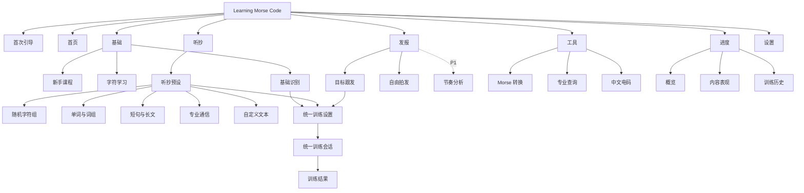
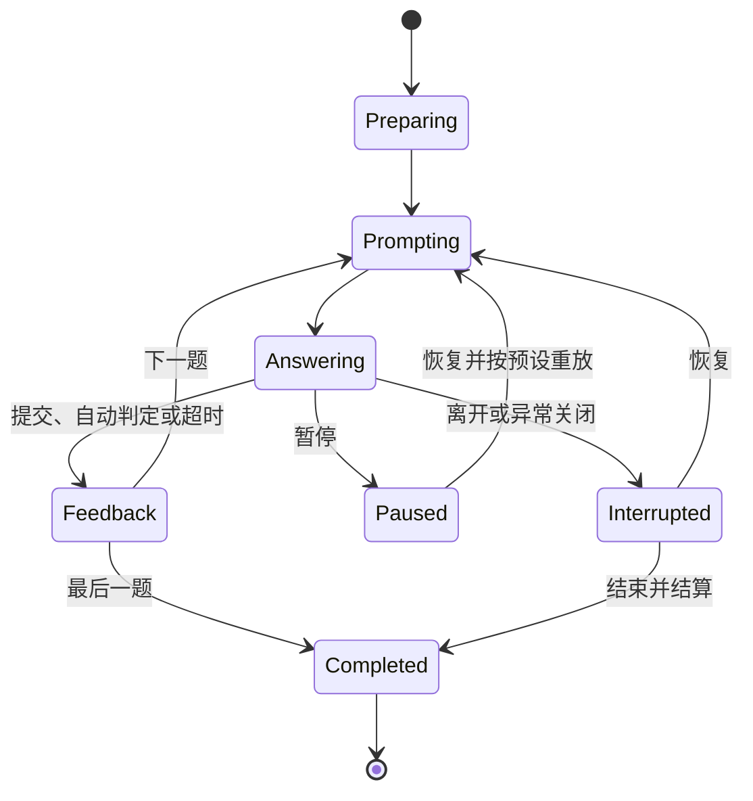

# Learning Morse Code V2 信息架构

> 本文档定义 V2 页面层级、导航、路由、内容优先级以及旧功能迁移关系。功能范围见 [FeatureList.md](./FeatureList.md)，产品行为见 [ProductSpec.md](./ProductSpec.md)。

## 1. 文档信息

| 项目 | 内容 |
| --- | --- |
| 文档版本 | 0.2.1 |
| 状态 | V2 信息架构已确认；断代式重构实施中 |
| 更新日期 | 2026-07-16 |
| 适用平台 | Web/PWA、移动应用容器、桌面应用容器 |

## 2. V2 架构原则

1. **四大功能域**：基础学习、听抄接收、发报节奏、查询转换的归属必须清晰。
2. **首页是入口，不是功能域**：首页负责继续训练、推荐和全局状态。
3. **内容与训练分离**：字母、词组、Q 简语等以内容包复用；页面表达用户任务，不复制引擎。
4. **训练会话统一**：所有计分训练共用设置、专注会话、结果和恢复结构。
5. **渐进披露**：功能域首页先展示可用预设；专业参数和未实现内容不抢占首屏。
6. **V2 状态可恢复**：从 V2 新建的会话、深链接、课程进度和历史必须稳定恢复；旧状态不兼容。
7. **跨端同义**：导航形态可以改变，功能名称、页面归属和稳定 ID 不改变。
8. **避免空页面**：未实现的 P1/P2 能力不进入主导航，不创建可点击的“敬请期待”页。

## 3. 顶层站点地图

虚线节点为后续能力。未实现前不显示可点击入口。

## 4. 全局导航

### 4.1 一级导航

一级导航固定为五项：

1. 首页
2. 基础
3. 听抄
4. 发报
5. 工具

“基础、听抄、发报、工具”分别对应四大功能域。“进度”和“设置”通过全局页头或首页快捷入口进入，不占移动端五项导航名额。

### 4.2 命名理由

| 导航名称 | 完整页面标题 | 理由 |
| --- | --- | --- |
| 基础 | 基础学习与识别 | 移动端短标签；覆盖课程、字符和识别 |
| 听抄 | 听抄与接收训练 | 使用用户熟悉的主要任务名称 |
| 发报 | 发报与节奏训练 | 包含目标跟发和自由拍发，不局限“自由发报” |
| 工具 | 查询与转换工具 | 包含 Morse、专业术语和中文电码 |
| 进度 | 学习进度与统计 | 强调下一步行动，不只展示图表 |

### 4.3 桌面端

- 使用左侧导航栏显示首页和四大功能域。
- 侧栏底部显示“进度”和“设置”，视觉层级低于四大功能域。
- 页头显示页面标题、离线/安装/更新状态和上下文操作。
- 训练会话、自由拍发和长文听抄可以使用宽工作区。

### 4.4 移动端

- 底部导航显示：首页、基础、听抄、发报、工具。
- 进度和设置从首页顶部或全局菜单进入。
- 进入统一训练会话后隐藏底部导航。
- 自由拍发按键区与底部安全区域保持间距，避免误触导航。
- 工具的文本输入页在软键盘打开时允许底部导航收起，但不丢失输入。

### 4.5 平板端

- 竖屏采用移动端底部导航。
- 横屏或足够宽时切换为桌面侧栏。
- 字符学习、专业查询和设置可使用主从双栏。
- 断点切换不改变当前路由、会话、输入或滚动上下文。

### 4.6 全局状态

| 状态 | 呈现位置 | 行为 |
| --- | --- | --- |
| 离线 | 页头轻量标记 | 不阻塞已缓存课程、训练和工具 |
| 可安装 PWA | 首页或页头菜单 | 用户主动触发，不反复弹窗 |
| 音频未解锁 | 首个需要声音的页面 | 显示明确启用按钮 |
| 数据无法保存 | 全局状态条 | 持续提示并提供导出/诊断入口 |
| 应用更新可用 | 非会话状态条 | 用户确认更新，会话中不强制刷新 |
| V2 数据初始化失败 | 全局恢复页 | 停止写入并提供重试、导出诊断和清空 V2 数据说明 |

## 5. V2 路由结构

### 5.1 全局与功能域路由

| 路由 | 页面 | 优先级 | 导航层级 | 首批状态 |
| --- | --- | --- | --- | --- |
| `/` | 启动路由 | P0 | 系统 | 保留 |
| `/onboarding` | 首次引导 | P0 | 独立流程 | 保留并改入口文案 |
| `/home` | 首页 | P0 | 一级 | 重构 |
| `/learn` | 基础学习与识别 | P0 | 一级 | 保留路由，重构页面 |
| `/learn/courses` | 新手课程 | P0/P1 | 二级 | 迁移现有双字符课程 |
| `/learn/characters` | 字符学习 | P0 | 二级 | 新增列表路由 |
| `/learn/character/:symbol` | 字符详情 | P0 | 三级/主从详情 | 保留 |
| `/receive` | 听抄与接收训练 | P0/P1 | 一级 | 新增 |
| `/send` | 发报与节奏训练 | P0/P1 | 一级 | 新增 |
| `/send/free` | 自由拍发 | P0 | 二级 | 由 `/keyer` 迁移 |
| `/tools` | 查询与转换工具 | P0/P1 | 一级 | 新增；首批至少开放 Morse 转换 |
| `/tools/morse` | Morse 转换 | P0 | 二级 | 新增 |
| `/tools/reference` | 专业查询 | P1 | 二级 | 首批可先展示已审校内容 |
| `/tools/chinese-telegraph` | 中文电码 | P1/P2 | 二级 | 数据源确认后开放 |
| `/progress` | 学习进度与统计 | P0 | 全局 | 由 `/stats` 迁移 |
| `/progress/content` | 内容表现 | P0/P1 | 二级 | 由字符表现扩展 |
| `/progress/history` | 训练历史 | P0 | 二级 | 迁移 |
| `/settings/*` | 设置 | P0 | 全局 | 保留 |

### 5.2 统一训练路由

| 路由 | 页面 | 说明 |
| --- | --- | --- |
| `/training/setup/:presetId` | 统一训练设置 | `presetId` 决定功能域、题面和适用参数 |
| `/training/session/:sessionId` | 统一训练会话 | 通过已保存 definition 恢复，不依赖 URL 猜测模式 |
| `/training/result/:sessionId` | 统一训练结果 | 按功能域和内容包展示指标 |

首批稳定预设 ID：

| V2 presetId | 功能域 | 对应现有 mode |
| --- | --- | --- |
| `learn.character.encode` | 基础 | `character-to-code` |
| `learn.character.decode` | 基础 | `code-to-character` |
| `receive.character.audio` | 听抄 | `sound-to-character` |
| `send.character.guided` | 发报 | `character-to-keying` |
| `review.mistakes` | 跨域复习 | `mistakes`，根据原题保留功能域 |

### 5.3 路由规则

- `presetId`、内容包 ID 和 mode ID 是稳定协议，不使用显示名称作为数据键。
- 统一会话通过 `sessionId` 和保存的 definition 恢复，不依赖内存状态。
- 旧 `/practice/*`、`/keyer`、`/stats/*` 不再解析，不设置重定向或别名。
- 无效预设、内容包或会话显示可恢复错误页，并返回来源功能域。
- 特殊字符详情使用安全编码；工具输入正文不进入 URL 查询参数。
- 未实现的 P1/P2 页面不出现在主导航，也不创建阻塞主流程的占位页。

## 6. 核心页面规格

### 6.1 首页 `/home`

**页面目标**：让用户继续上次训练或在一次选择内进入正确功能域。

**信息优先级**：

1. 继续未完成会话或当前课程。
2. 推荐训练及理由。
3. 四大功能域入口。
4. 薄弱内容和快速强化。
5. 学习进度摘要。
6. 安装、离线和更新等非核心状态。

新用户以“开始基础课程”为主操作；旧用户升级后以“继续上次训练”为主操作。首页不展示未开放功能的巨大卡片。

### 6.2 基础学习与识别 `/learn`

**页面目标**：回答“我应该学什么”和“我需要巩固什么”。

**首批区域**：

1. 继续当前新手课程。
2. 字符学习：字母、数字、标点。
3. 基础识别预设：字符编码、点划解码。
4. 薄弱字符和错题复习。

桌面可使用课程/字符网格与详情双栏；手机进入独立详情。现有字符详情的播放、跟敲和时长指示全部保留。

### 6.3 听抄与接收 `/receive`

**页面目标**：根据内容和能力阶段快速开始声音接收训练。

**首批开放**：

- 单字符听抄：迁移现有声音 → 字符。

**后续预设顺序**：

1. 随机字符组。
2. 单词与词组。
3. 短句、长文与报文。
4. 呼号和专业通信。
5. 自定义文本。

“听抄训练台”表现为统一设置页和预设高级设置，不作为与内容预设平级的卡片。

### 6.4 发报与节奏 `/send`

**页面目标**：让用户选择计分的目标跟发或非计分的自由拍发。

**首批区域**：

1. 字符目标跟发：迁移现有字符 → 发报。
2. 自由拍发：迁移现有自由发报工作台。
3. 当前键位、速度和阈值摘要。
4. 最近发报表现或无数据说明。

后续加入词组/报文跟发和节奏分析。内容正确率与节奏得分在视觉上分开。

### 6.5 查询与转换 `/tools`

**页面目标**：不进入计分训练即可完成查询和转换，并允许把结果送入训练。

**功能分区**：

1. Morse 转换。
2. 国际 Morse 字符查询。
3. Q 简语、CW 缩略语、程序信号和数字简码查询。
4. 中文电码。

只展示已经具备可靠数据和行为的工具。工具结果提供播放、复制以及适用时的“去听抄”“去跟发”。

### 6.6 统一训练设置 `/training/setup/:presetId`

**页面目标**：在保留快速开始的同时，只显示当前预设适用的参数。

**共享设置**：内容范围、题量或时长、Character WPM、Effective WPM、随机顺序。

**听抄设置**：组长、逐题/连续、重播、纸笔模式、信道模拟。

**发报设置**：单键/双键、阈值、提示方式、自动判定等待、节奏评分。

不适用参数不显示。用户可以“仅用于本次”或明确“保存为该预设默认值”。

### 6.7 统一训练会话 `/training/session/:sessionId`

**页面目标**：每次只突出当前任务，并通过同一状态机覆盖三类训练。

**页面层级**：

1. 专注页头：退出、进度/剩余时间、暂停。
2. 题面：文字、Morse、声音或连续播放状态。
3. 作答：文本、选择、纸笔自评或发报按键区。
4. 反馈：正确答案、声音、节奏和下一题。
5. 弱化辅助：当前预设、速度、快捷键。

连续听抄可以在 `Prompting/Answering` 中按安全检查点推进，不另建第二套会话状态机。

### 6.8 训练结果 `/training/result/:sessionId`

**共享信息**：完成量、正确率、用时、错题和后续操作。

**听抄附加指标**：接收速度、重播、字符/内容类别错误和连续抄收完成度。

**发报附加指标**：内容正确率、点划和间隔偏差、节奏稳定性；未实现节奏分析时明确标记“未评分”。

**主要操作**：有错题时重练；无错题时提高难度或切换到下一内容级别。

### 6.9 自由拍发 `/send/free`

**页面区域**：输出、当前组合、实时按压与阈值、单/双键发报区、速度与编辑工具。

迁移后必须保持：

- 自定义键位与左右手预设。
- 按下即发声、释放停止和安全取消。
- 实时毫秒数、滑块和点/划状态。
- 可调整的自动字符提交等待。
- 退格、清空、空格、复制和播放。
- 完整正文默认不进入训练历史。

### 6.10 进度 `/progress`

**标签/分区**：概览、内容表现、历史。

**概览**：总训练、近期趋势、推荐下一步和四大功能域摘要。

**内容表现**：从现有字符统计扩展为字符、词组和专业内容；样本不足不排名。

**历史**：显示功能域、预设、内容包、速度、结果和详情入口。旧会话通过映射显示新的用户可读名称。

### 6.11 设置 `/settings/*`

| 分组 | 内容 |
| --- | --- |
| 外观 | 主题、强调色、字号、减少动画、高对比度 |
| 音频 | 音量、音调、音色、试听、反馈音效 |
| 输入与按键 | 单/双键默认、键位、阈值、左右手、校准 |
| 训练默认值 | 通用速度、题量、随机、超时以及预设默认值入口 |
| 数据与隐私 | 导出、导入、清空、迁移状态、正文保存策略 |
| 关于与帮助 | 新手引导、标准、术语、快捷键、版本和许可 |

## 7. 跨域入口与共享组件

### 7.1 查询到训练

专业查询详情可提供：

- 播放声音。
- 加入收藏或需要加强。
- 听抄这个内容。
- 跟发这个内容。

入口携带内容包 ID 和条目 ID，不把解释文本拼入 URL。

### 7.2 进度到训练

薄弱项根据可用能力展示一个或多个训练动作：识别、听抄、跟发。系统推荐一个主动作，但不隐藏其他适用方式。

### 7.3 页面间共享组件

| 组件 | 使用页面 | 责任 |
| --- | --- | --- |
| App Shell | 非引导和非专注会话 | 首页、四大功能域、全局状态和入口 |
| Domain Header | 四大功能域首页 | 说明目标、继续训练和最近设置 |
| Preset Card | 基础、听抄、发报 | 显示训练目标、内容、最近结果和快速开始 |
| Content Selector | 设置、工具、进度 | 选择内容包、分组和具体项目 |
| Audio Unlock/Controls | 所有声音页面 | 解锁、播放、停止、重播和故障提示 |
| Key Surface | 跟发、自由拍发、课程 | 单/双键输入、声音和按压状态 |
| Session Shell | 所有计分训练 | 状态机、进度、暂停、恢复和检查点 |
| Feedback Panel | 会话 | 正误、正确答案、声音和适用的节奏反馈 |
| Tool Workspace | 转换工具 | 输入、方向、结果、复制、播放和异常 |
| Progress Summary | 首页、进度、功能域 | 指标摘要和下一步动作 |

共享组件统一交互和呈现；训练规则、内容生成和评分仍位于核心模块。

## 8. 响应式与可访问性要求

- 紧凑布局使用单列和底部五项导航；详情、设置和查询逐层进入。
- 中等布局允许主从双栏，保持触摸友好和稳定历史记录。
- 宽布局使用侧栏；训练会话保持视觉居中，自由拍发和长文听抄可扩宽。
- 页面载入后焦点进入标题或主要任务，不无条件抢占文本输入。
- 训练反馈通过状态区域播报，不重复朗读整页。
- 物理按键监听不得阻断 Tab、Escape 等必要导航键。
- 模态确认关闭后焦点返回触发控件。
- 屏幕阅读器启用时，发报触摸区提供替代操作说明。

## 9. 旧功能与页面迁移表

本节是代码重构时的旧入口处置权威表。V2 采用断代式切换：新入口一次生效，旧路由直接删除。

### 9.1 页面与路由迁移

| 当前页面/路由 | 当前能力 | V2 页面/路由 | 决定 | V2 数据规则 |
| --- | --- | --- | --- | --- |
| `/home` | 首页、四模式入口、摘要 | `/home` | 原路由重构 | 保留继续会话、统计摘要和 PWA 状态 |
| `/learn` | 字符表、字符详情双栏 | `/learn` | 改为基础域首页 | 字符表移入“字符学习”，保留筛选状态 |
| `/learn/character/:symbol` | 字符详情、播放、跟敲 | 原路由 | 完整保留 | 深链接、字符统计和输入反馈不变 |
| 练习中心内六阶段课程 | 双字符引导课程 | `/learn/courses` | 重建为新手课程 | V2 解锁进度从零开始 |
| `/practice` | 四种模式和引导课程 | 分流到 `/learn`、`/receive`、`/send` | 删除 | 返回 V2 未找到页 |
| `/practice/setup/sound` | 声音 → 字符设置 | `/training/setup/receive.character.audio` | 删除旧路由 | 新 presetId 从空设置开始 |
| `/practice/setup/code` | Morse → 字符设置 | `/training/setup/learn.character.decode` | 删除旧路由 | 新 presetId 从空设置开始 |
| `/practice/setup/encode` | 字符 → Morse 设置 | `/training/setup/learn.character.encode` | 删除旧路由 | 新 presetId 从空设置开始 |
| `/practice/setup/send` | 字符 → 发报设置 | `/training/setup/send.character.guided` | 删除旧路由 | 新 presetId 从空设置开始 |
| `/practice/session/:sessionId` | 统一旧会话 | `/training/session/:sessionId` | 删除旧路由 | 不读取旧 definition 或会话 |
| `/practice/result/:sessionId` | 旧结果页 | `/training/result/:sessionId` | 删除旧路由 | 不读取旧结果 |
| `/keyer` | 自由发报 | `/send/free` | 删除旧路由并重命名能力 | V2 使用新设置键 |
| `/stats` | 统计概览 | `/progress` | 删除旧路由并重命名能力 | V2 统计从零开始 |
| `/stats/characters` | 字符表现 | `/progress/content` | 删除旧路由 | 只读取 V2 字符统计 |
| `/stats/history` | 训练历史 | `/progress/history` | 删除旧路由 | 只读取 V2 训练历史 |
| `/settings/*` | 六组设置 | 原路由 | 页面保留、数据重置 | 使用 V2 新设置命名空间 |
| `/input` 概念 | 应用内输入法预留 | 暂不进入 V2 导航 | 延后 | 不创建空页面，不删除路线记录 |

### 9.2 功能入口迁移

| 旧入口名称 | V2 入口 | 处理方式 |
| --- | --- | --- |
| 字符 → Morse | 基础 / 字符编码 | 保留为预设 |
| Morse → 字符 | 基础 / 点划解码 | 保留为预设 |
| 声音 → 字符 | 听抄 / 单字符听抄 | 保留为预设 |
| 字符 → 发报 | 发报 / 字符目标跟发 | 保留为预设 |
| 重练最近错题 | 首页、进度和各功能域的错题复习 | 根据原题 mode 选择功能域 |
| 双字符引导课 | 基础 / 新手课程 | 保留课程顺序和解锁状态 |
| 自由发报 | 发报 / 自由拍发 | 重命名，能力不降级 |
| 字符表 | 基础 / 字符学习；工具 / 字符查询 | 学习带进度，查询侧重检索；共用字符数据 |

### 9.3 新需求去重与归属

| 原提议 | V2 归属 | 去重决定 |
| --- | --- | --- |
| 新手基础练习 | 基础 / 新手课程 | 独立于自由字符复习 |
| 字母练习 | 基础 / 字符学习与识别 | 扩展为字母、数字、标点字符训练 |
| 词组练习 | 共享词组内容包 | 由识别、听抄和跟发预设复用 |
| 大篇幅练习 | 听抄 / 长文与报文 | 改用专业名称，采用连续抄收 |
| QC 简语练习 | Q 简语内容包 | 纠正术语；查询、听抄、跟发复用 |
| 数字短码练习 | 数字简码内容包 | 改名并标记 Cut Numbers 方案 |
| 抄报练习器 | 听抄训练台 | 作为统一设置/会话壳，不作为内容卡 |
| 字母抄报练习 | 听抄 / 随机字符组 | 通过“纯字母”筛选实现 |
| 随机字母/数字 | 听抄 / 随机字符组 | 与字母抄报合并 |
| 词组抄报练习 | 听抄 / 单词与词组 | 使用共享词组内容包 |
| 数字短码抄报 | 听抄 / 数字简码 | 使用共享数字简码内容包 |
| 自定义发报（接收场景） | 听抄 / 自定义文本 | 改名为自定义文本听抄 |
| 自由拍发练习 | 发报 / 自由拍发 | 从窄一级栏目扩展为发报域的子功能 |
| 摩斯电码转换 | 工具 / Morse 转换 | 非计分操作，可进入训练 |
| 汉字转电码 | 工具 / 中文电码 | 汉字 → 四位代码 |
| 电码转汉字 | 工具 / 中文电码 | 四位代码 → 汉字候选 |

## 10. 断代发布顺序

1. 定义 V2 route、presetId、新数据库、data schema 和 localStorage 键。
2. 一次性切换首页、基础、听抄、发报和工具的新 App Shell 导航。
3. 将四种成熟训练能力接到对应功能域，并删除所有旧路由解析。
4. 将自由发报重挂到 `/send/free`，统计重挂到 `/progress`，课程重挂到 `/learn`。
5. 更新深链接、PWA 缓存、帮助和测试，验证旧 URL 均进入未找到页。
6. 在新结构稳定后逐批开放词组、长文、专业内容和中文电码工具。

## 11. 信息架构验收标准

- [ ] 首页之外的四个一级功能入口与四大功能域一一对应。
- [ ] 用户可以在三次操作内从首页进入任一现有训练。
- [ ] 用户能区分计分的目标跟发与非计分的自由拍发。
- [ ] 字母听抄和随机字母/数字不再表现为重复页面。
- [ ] 听抄训练台不与内容预设平级。
- [ ] 进度与设置全局可发现，但不占移动端四大功能域位置。
- [ ] 移动端底部导航不超过五项。
- [ ] 所有统一训练会话隐藏全局导航。
- [x] 旧会话、结果、课程、统计和设置不被 V2 读取。
- [x] 旧 URL 直接进入未找到页，不重定向、不兼容解析。
- [ ] 未实现功能不会形成可点击空页面。
- [ ] 桌面与移动端使用相同页面名称和功能归属。

## 12. 已确认的设计与开发产出

1. 更新路由模型、导航配置和旧 mode → presetId 映射设计。
2. 为首页、四大功能域首页、统一设置、统一会话、结果和自由拍发制作低保真线框。
3. 定义 Preset Card、Content Selector、Domain Header 和 Tool Workspace 组件规格。
4. 更新训练 definition、数据库名称和 data schema；不实现旧数据迁移器。
5. 按第 10 节顺序重构页面并同步删除旧路由。
6. 执行桌面、375px 移动端、键盘、Pointer、离线更新、V2 新数据恢复和旧 URL 删除回归。
