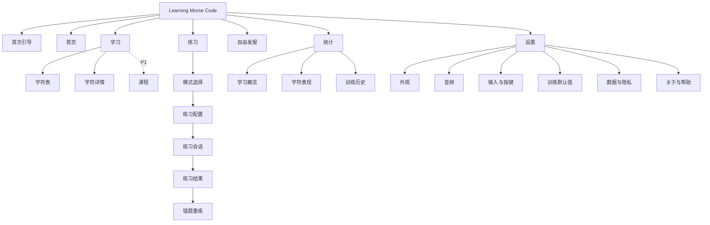
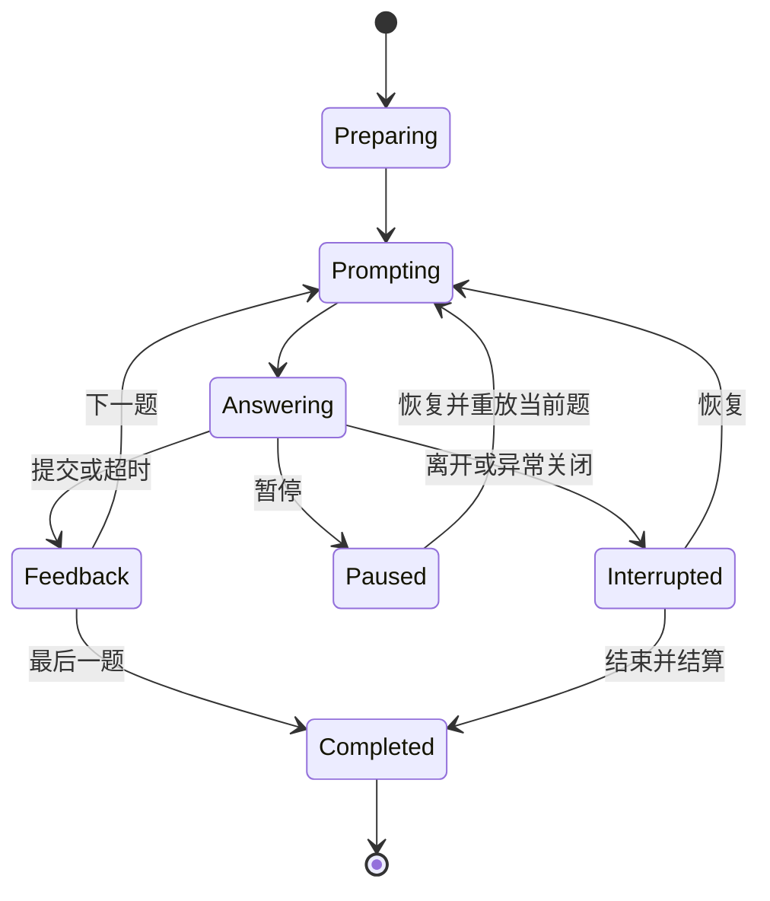
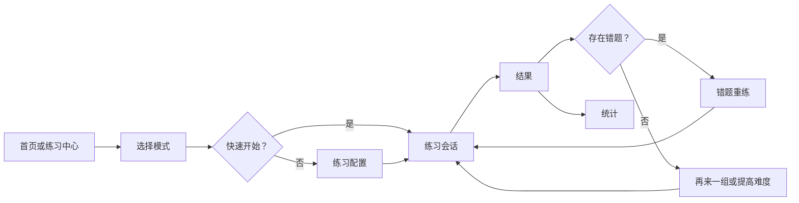
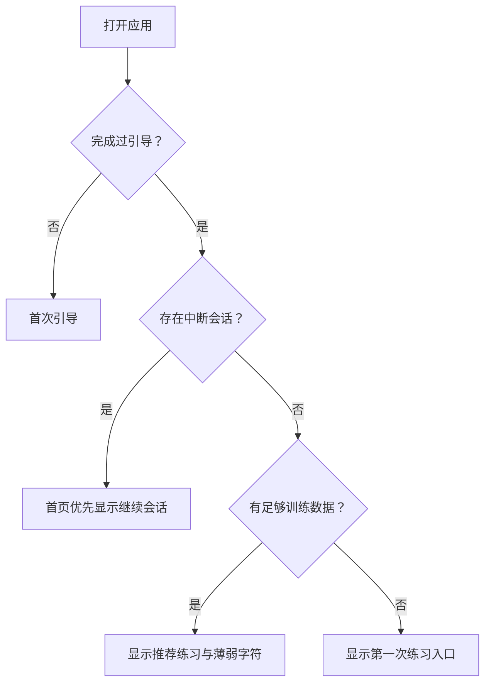

# Learning Morse Code 信息架构

> 本文档定义 MVP 的页面层级、导航、路由、内容优先级和响应式结构。功能范围见 [FeatureList.md](./FeatureList.md)，产品行为见 [ProductSpec.md](./ProductSpec.md)。

## 1. 文档信息

| 项目 | 内容 |
| --- | --- |
| 文档版本 | 0.1.0 |
| 状态 | MVP 信息架构草案 |
| 更新日期 | 2026-07-15 |
| 适用平台 | Web/PWA、移动应用容器、桌面应用容器 |

## 2. 架构原则

1. **训练优先**：任何核心训练都应在首页起三次操作内开始。
2. **渐进披露**：快速开始优先，高级速度和字符设置按需展开。
3. **会话专注**：练习期间收起非必要导航，只保留退出、暂停和必要设置。
4. **跨端同义**：平台可以改变导航形态，但页面命名和功能归属不改变。
5. **状态可恢复**：进行中的会话、音频锁定和离线状态都必须有明确页面状态。
6. **避免空页面**：没有统计或历史数据时，页面提供下一步操作而非空图表。
7. **设置集中**：外观、音频、输入、训练和数据设置统一管理，不散落在多个页面。

## 3. 顶层站点地图

## 4. 全局导航

### 4.1 一级导航

一级导航固定为五项：

1. 首页
2. 学习
3. 练习
4. 发报
5. 统计

设置通过全局页头的设置按钮进入，不占用移动端底部导航位置。

### 4.2 桌面端

- 使用左侧导航栏。
- 宽屏状态可显示图标和文字，窄桌面状态收起为图标栏。
- 页头显示当前页面标题、离线/安装状态和设置入口。
- 主内容设置最大阅读宽度；练习会话和自由发报可使用更宽的工作区。

### 4.3 移动端

- 使用底部五项导航：首页、学习、练习、发报、统计。
- 页头仅保留页面标题和当前页面必要操作。
- 设置从首页/页头齿轮进入。
- 底部导航避让安全区域；发报按键区不得与导航产生误触。
- 进入练习会话后隐藏底部导航，使用专注模式页头。

### 4.4 平板端

- 竖屏采用移动端底部导航。
- 横屏或足够宽时切换为桌面侧栏。
- 字符表和设置可使用主从双栏，但路由和浏览器历史保持独立。

### 4.5 全局状态

| 状态 | 呈现位置 | 行为 |
| --- | --- | --- |
| 离线 | 页头轻量标记 | 不阻塞核心功能 |
| 可安装 PWA | 首页或页头菜单 | 用户主动触发，不反复弹窗 |
| 音频未解锁 | 首个需要声音的页面 | 显示明确启用按钮 |
| 数据无法保存 | 全局状态条 | 持续提示，提供诊断/导出入口 |
| 应用更新可用 | 非会话页面状态条 | 用户确认后刷新；会话中不强制更新 |

## 5. 路由结构

| 路由 | 页面 | 优先级 | 导航层级 | 备注 |
| --- | --- | --- | --- | --- |
| `/` | 启动路由 | P0 | 系统 | 首次进入引导，否则进入首页 |
| `/onboarding` | 首次引导 | P0 | 独立流程 | 可跳过、可恢复 |
| `/home` | 首页 | P0 | 一级 | 默认返回页 |
| `/learn` | 学习中心/字符表 | P0 | 一级 | 默认展示字符表 |
| `/learn/character/:symbol` | 字符详情 | P0 | 二级 | 支持深链接 |
| `/practice` | 练习中心 | P0 | 一级 | 模式选择与快速开始 |
| `/practice/setup/:mode` | 练习配置 | P0 | 二级 | `mode` 为四种基础模式之一 |
| `/practice/session/:sessionId` | 练习会话 | P0 | 专注流程 | 隐藏一级导航 |
| `/practice/result/:sessionId` | 练习结果 | P0 | 专注流程末端 | 可进入重练或统计 |
| `/keyer` | 自由发报 | P0 | 一级 | 单键/双键工作区 |
| `/stats` | 统计概览 | P0 | 一级 | 默认近期范围 |
| `/stats/characters` | 字符表现 | P0 | 二级 | 可筛选和发起强化练习 |
| `/stats/history` | 训练历史 | P0 | 二级 | MVP 可采用列表，不要求复杂图表 |
| `/settings` | 设置入口 | P0 | 全局 | 重定向到首个设置分组 |
| `/settings/appearance` | 外观 | P0 | 设置二级 | 主题、强调色、动效、字号 |
| `/settings/audio` | 音频 | P0 | 设置二级 | 音调、音色、音量、测试 |
| `/settings/input` | 输入与按键 | P0 | 设置二级 | 键位、阈值、左右手、校准 |
| `/settings/training` | 训练默认值 | P0 | 设置二级 | 默认速度、题量、反馈 |
| `/settings/data` | 数据与隐私 | P0 | 设置二级 | 导入、导出、清空、隐私说明 |
| `/settings/about` | 关于与帮助 | P0 | 设置二级 | 引导、标准、版本、许可 |
| `/learn/courses` | 课程 | P1 | 学习二级 | MVP 不在导航中展示 |
| `/input` | 应用内输入法 | P1 | 发报二级 | MVP 只预留概念，不创建空页面 |

### 5.1 路由规则

- 进行中的会话通过 `sessionId` 恢复，不能仅依赖内存状态。
- 不支持的 `mode` 或无效 `sessionId` 显示可恢复错误页，并提供返回练习中心入口。
- 字符详情 URL 使用规范化 ASCII 符号；特殊标点必须安全编码。
- 未实现的 P1/P2 页面不出现在正式导航，也不使用“敬请期待”占位阻塞主流程。
- 原生应用的系统返回操作与浏览器历史保持一致；离开会话前执行中断确认规则。

## 6. 核心页面规格

### 6.1 首次引导 `/onboarding`

**页面目标**：让新用户理解核心概念、成功听到声音并完成第一组题。

**步骤结构**：

1. 欢迎与语言确认。
2. 点、划和间隔的声音演示。
3. 声音启用与音量确认。
4. 输入方式选择及可跳过校准。
5. 10 题引导练习。
6. 简短结果与下一步建议。

**主要操作**：继续。

**次要操作**：跳过、返回、静音继续。

**特殊状态**：音频无法启动、用户中途退出、设备无振动能力、存储不可用。

### 6.2 首页 `/home`

**页面目标**：帮助用户立即开始最有价值的下一次训练。

**信息优先级**：

1. 继续上次训练或开始第一次练习。
2. 推荐练习及原因。
3. 四种基础模式快捷入口。
4. 薄弱字符与强化入口。
5. 简短学习摘要。
6. PWA 安装等非核心提示。

**新用户状态**：用“第一次声音练习”替代空统计和薄弱字符。

**返回用户状态**：若存在中断会话，继续会话优先于推荐练习。

**禁止事项**：首页不直接展开全部高级参数，不用排行榜或成就抢占首屏。

### 6.3 学习中心 `/learn`

**页面目标**：浏览、搜索、试听并学习受支持字符。

**页面区域**：

- 顶部：搜索与分组筛选。
- 主区：字母、数字、标点字符网格。
- 字符卡：字符、简短点划表示、掌握/加强状态。
- 详情区：字符、点划、声音播放、节奏动画、加强标记、开始练习。

**响应式行为**：

- 桌面/宽平板：网格与详情双栏。
- 手机：点击卡片进入独立字符详情页。

**空状态**：搜索无结果时显示清除筛选，不创建虚假字符。

### 6.4 练习中心 `/practice`

**页面目标**：选择训练目标并快速开始。

**模式卡片**：

1. 字符 → Morse。
2. Morse → 字符。
3. 声音 → 字符。
4. 字符 → 发报。

每张卡片包含一句训练目的、最近一次结果、快速开始和自定义设置。

**次级区域**：错题重练、收藏字符训练、最近配置。

**禁止事项**：不要以技术术语命名模式；名称旁提供清晰的输入/输出方向。

### 6.5 练习配置 `/practice/setup/:mode`

**页面目标**：在不增加认知负担的情况下配置一组练习。

**默认可见设置**：字符范围、题量、速度、随机顺序。

**高级折叠设置**：有效速度、超时、反馈方式、重播行为、保存为默认。

**底部操作**：固定的“开始练习”主按钮；移动端避让安全区域。

**校验状态**：无字符、速度关系无效、按键不可用、不支持字符。

### 6.6 练习会话 `/practice/session/:sessionId`

**页面目标**：让用户专注完成当前一道题。

**页面层级**：

1. 专注页头：退出、进度、暂停。
2. 题目区：字符、点划或声音播放状态。
3. 作答区：文本输入、选择输入或发报按键区。
4. 即时反馈区：正确/错误、正确答案、重播。
5. 辅助区：快捷键提示、当前速度；默认弱化。

**状态机**：

**专注规则**：隐藏一级导航；反馈出现前不展示本轮统计图；键盘焦点不跳到不可预测位置。

### 6.7 练习结果 `/practice/result/:sessionId`

**页面目标**：解释结果并推动下一次有效行动。

**信息优先级**：

1. 正确率、平均反应时间、用时、错题数。
2. 本轮表现摘要。
3. 错题列表，可逐题重播。
4. 薄弱字符。
5. 后续操作。

**主要操作规则**：

- 有错题：重练错题。
- 无错题：提高难度或再来一组。

**次要操作**：查看统计、返回练习中心、返回首页。

### 6.8 自由发报 `/keyer`

**页面目标**：提供低延迟、可观察、可恢复的 Morse 自由输入体验。

**页面区域**：

1. 输出区：已解码文本。
2. 当前组合区：尚未提交的点划。
3. 时序反馈区：按下时长、阈值和节奏状态。
4. 发报区：单键大按钮，或点/划双按钮。
5. 工具区：模式、速度、删除、清空、复制、播放。

**响应式行为**：

- 移动端发报区固定在拇指易达区域，优先保证按键尺寸。
- 桌面端显示键盘映射，并允许输出与时序信息并排。
- 切换单键/双键不会清空已解码文本。

**隐私状态**：明确说明完整自由输入正文默认不进入训练历史。

### 6.9 统计 `/stats`

**页面目标**：回答“我进步了吗”和“下一步练什么”。

**标签/分区**：概览、字符表现、历史。

**概览内容**：学习时长、练习次数、正确率、速度、近期趋势、薄弱字符。

**字符表现**：字符、正确率、平均反应时间、样本数、最近练习、强化入口。

**历史**：日期、模式、题量、正确率、速度和结果页入口。

**无数据状态**：解释完成练习后会出现哪些数据，并提供开始练习按钮。

### 6.10 设置 `/settings/*`

**页面目标**：集中管理不应打断训练的个性化和数据操作。

| 分组 | 内容 |
| --- | --- |
| 外观 | 主题、强调色、字号、减少动画、高对比度 |
| 音频 | 音量、音调、音色、试听、界面音效 |
| 输入与按键 | 单/双键默认、键位、点划阈值、左右手、校准 |
| 训练默认值 | 默认题量、Character/Effective WPM、随机、超时、反馈 |
| 数据与隐私 | 导出、导入、清空、存储状态、隐私说明 |
| 关于与帮助 | 重放引导、Morse 标准、快捷键、版本、许可 |

**响应式行为**：桌面为设置侧栏加内容区；手机先显示设置分组列表，再进入单组页面。

## 7. 核心流程图

### 7.1 练习闭环

### 7.2 返回用户启动逻辑

## 8. 页面状态清单

所有核心页面在设计和测试时必须覆盖适用状态：

| 状态类型 | 示例 |
| --- | --- |
| 初始 | 新用户、无训练记录、未修改设置 |
| 正常 | 有数据、音频可用、在线或离线正常工作 |
| 加载 | 本地数据恢复、导入校验、页面首次初始化 |
| 空 | 搜索无结果、无统计、无错题 |
| 错误 | 音频失败、存储失败、无效路由、备份无效 |
| 离线 | 无网络但核心资源可用 |
| 权限/能力缺失 | 无振动、PWA 不可安装、系统保留键位 |
| 中断恢复 | 未完成会话、应用后台恢复、音频上下文挂起 |
| 危险操作确认 | 清空数据、覆盖导入、退出未完成会话 |

## 9. 响应式布局断点原则

具体像素值在视觉系统中确定；信息架构按能力而非设备名称切换：

- **紧凑布局**：单列、底部导航、字符详情独立页面、设置逐层进入。
- **中等布局**：可使用双栏，但保持触摸友好；导航根据可用宽度选择底部或侧栏。
- **宽布局**：侧栏导航，学习和设置采用主从布局，练习区保持视觉居中。

不得仅根据 User-Agent 决定布局。横竖屏切换不能丢失会话、输入内容或滚动上下文。

## 10. 页面间共享组件

| 组件 | 使用页面 | 责任 |
| --- | --- | --- |
| App Shell | 除引导和专注会话外 | 一级导航、页头、全局状态 |
| Audio Unlock | 引导、学习、练习、发报 | 解锁、重试和音频故障提示 |
| Morse Symbol | 学习、会话、结果、统计 | 一致显示字符与点划 |
| Audio Controls | 学习、会话、结果、设置 | 播放、停止、重播及状态 |
| Key Surface | 发报练习、自由发报 | 单键/双键输入和按压状态 |
| Session Progress | 练习会话 | 题号、总题量、暂停 |
| Feedback Panel | 练习会话 | 正误、正确答案、重播 |
| Character Selector | 练习配置、统计强化 | 选择分组和具体字符 |
| Empty State | 首页、统计、搜索、历史 | 解释状态并提供下一步 |
| Destructive Confirm | 数据设置、会话退出 | 防止不可逆误操作 |

共享组件只统一交互和呈现，不承载训练规则；训练规则由后续核心模块负责。

## 11. 可访问性导航要求

- 一级导航、页面标题和主内容区具有明确语义。
- 页面载入后焦点进入页面标题或主要任务区，不无条件抢占文本输入焦点。
- 练习反馈通过可访问状态区域播报，但不得重复朗读整页。
- 自由发报的物理按键监听不能阻断 Tab、Escape 等必要导航键，除非用户明确映射且确认。
- 模态确认打开时约束焦点，关闭后返回触发控件。
- 移动端屏幕阅读器启用时，发报触摸区提供替代操作说明。

## 12. 命名与文案映射

| 内部概念 | 中文界面 | 英文界面 |
| --- | --- | --- |
| Learn | 学习 | Learn |
| Practice | 练习 | Practice |
| Keyer | 发报 | Keyer |
| Stats | 统计 | Stats |
| Character WPM | 字符速度 | Character WPM |
| Effective WPM | 有效速度 | Effective WPM |
| Dot | 点 | Dot |
| Dash | 划 | Dash |
| Retry mistakes | 重练错题 | Retry mistakes |
| Needs work | 需要加强 | Needs work |

“发报”用于训练和自由输入页面；“输入法”仅用于 P1 之后的应用内/系统输入能力，避免 MVP 阶段混淆。

## 13. 信息架构验收标准

- [ ] 新用户可以从启动到首次练习，不经过账户或无关权限页面。
- [ ] 首页到任一基础练习不超过三次操作。
- [ ] 首页到自由发报不超过一次一级导航操作。
- [ ] 结果页到错题重练不超过一次操作。
- [ ] 设置在所有非专注页面可发现，但不占移动端一级导航名额。
- [ ] 移动端一级导航不超过五项。
- [ ] 练习会话隐藏会分散注意力的全局导航。
- [ ] 所有 P0 页面都有初始、空、错误和恢复状态定义。
- [x] 进行中的会话可以通过稳定路由和本地状态恢复。
- [ ] 桌面和移动端使用相同页面名称和功能归属。

## 14. 下一步设计产出

1. 为首次引导、首页、练习中心、练习会话、结果和自由发报制作低保真线框。
2. 使用 3 个任务进行可用性走查：首次练习、错题重练、自由发报。
3. 定义设计令牌和四个 MVP 主题的视觉方向。
4. 定义练习会话、按键按压、反馈和音频状态的交互原型。
5. 将确认后的页面状态转化为组件清单和端到端测试场景。
